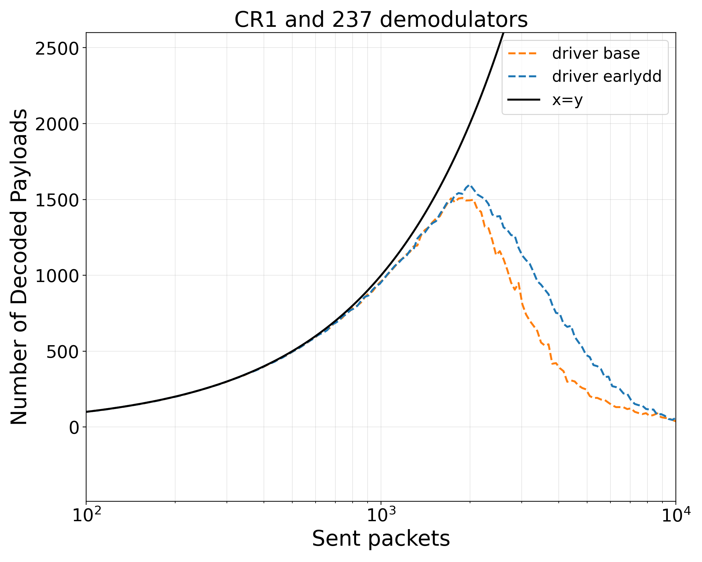
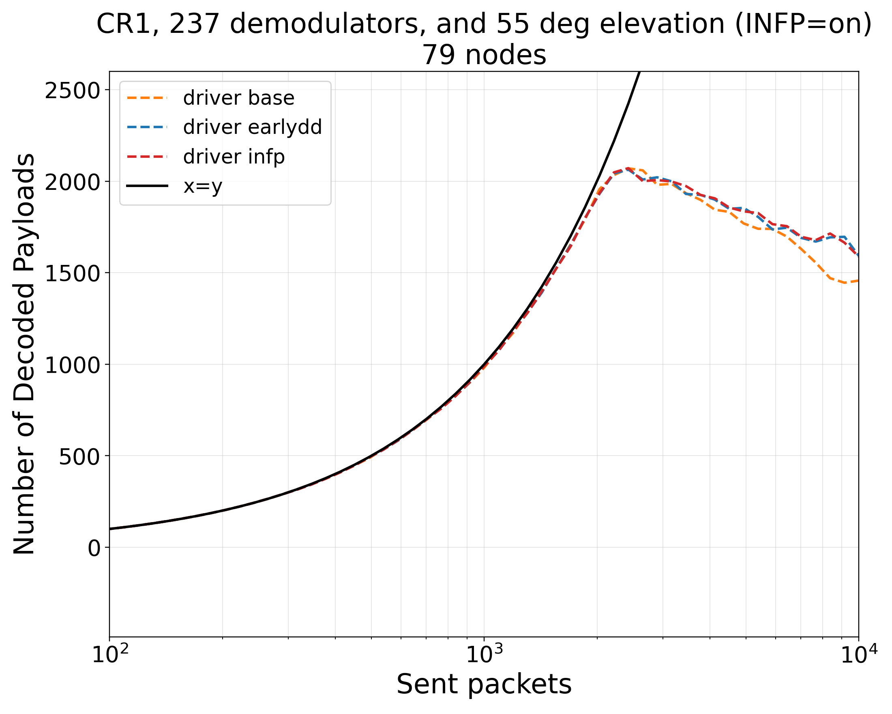
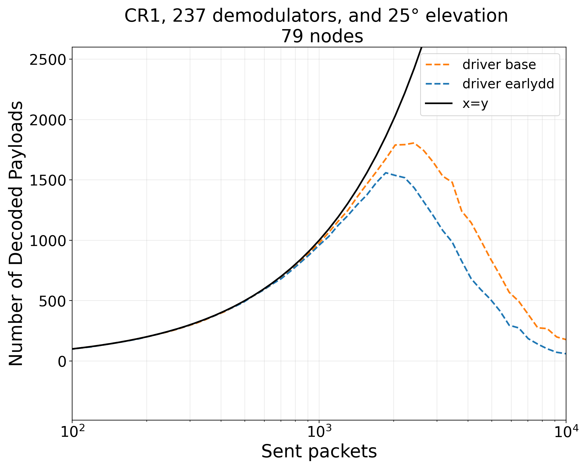

---
marp: true
paginate: true
math: katex
---

# End-to-End Workflow
### Based on LR-FHSS Framework and 3GPP TR 38.811

Cross-Layer Pipeline

- Orbit -> satellite position
- Coverage -> user distribution
- Load -> active devices
- Channel -> SNR / SINR
- Decoding -> successful packets
- Power -> energy consumption

---

# Project Repository

https://github.com/SatNaingTun/LRFHSS_MultiBeam_Integration.git

---

# Problem Statement
### What Is Estimated at Each Step

Given satellite state at step $t$, estimate:

1. covered population $P_{\text{cov}}(t)$
2. calculated nodes $N_{\text{node}}(t)$
3. calculated demodulators $N_{\text{demod}}(t)$
4. elevation-conditioned load and decoding behavior
5. busy/idle/sleep demod split and power

---

# Workflow

- Set input data, simulation steps, and elevation scenarios.
- Move the satellite step by step along the orbit.
- For each step, estimate covered population.
- Convert covered population into active nodes and available demodulators.
- For each elevation case, split demodulators into busy, idle, and sleep states.
- Run LR-FHSS decoding simulation for each elevation case.
- Save output files for each step.
- Merge all steps into time-series results.
- Plot time vs decoded payloads.
- Plot time vs energy.
- Plot time vs demodulator states.

---

# Orbit Mean Motion

$$
n=\sqrt{\frac{\mu}{a^3}}
$$

- Symbols: $n$ mean motion, $\mu$ Earth gravitational parameter, $a$ semi-major axis.
- Ref: Orbital mechanics (Vallado) https://doi.org/10.1007/978-1-4939-0802-8

---

# Mean Anomaly Update

$$
M(t)=M_0+n(t-t_0)
$$

- Symbols: $M(t)$ anomaly at time $t$, $M_0$ anomaly at reference epoch $t_0$, $n$ mean motion.
- Ref: Orbital mechanics (Vallado) https://doi.org/10.1007/978-1-4939-0802-8

---

# Horizon Central Angle

$$
\psi_h=\arccos\left(\frac{R_E}{r_{\text{orb}}}\right)
$$

- Symbols: $\psi_h$ horizon central angle, $R_E$ Earth radius, $r_{\text{orb}}$ orbital radius.
- Ref: NTN geometry context https://www.3gpp.org/DynaReport/38.811.htm

---

# Geometric Footprint Radius

$$
R_{\text{geo}}=R_E\psi_h
$$

- Symbols: $R_{\text{geo}}$ geometric footprint radius, $R_E$ Earth radius, $\psi_h$ horizon central angle.
- Ref: NTN geometry context https://www.3gpp.org/DynaReport/38.811.htm

---
# Node Mapping

$$
N_{\text{node}}(t)=P_{\text{pop}}\rho_{\text{node}}
$$

- Symbols: $N_{\text{node}}(t)$ calculated nodes, $P_{\text{pop}}$ population base, $\rho_{\text{node}}$ node/population ratio.
- Ref: Implementation rule in `modules/satellite_stepper.py`

---

# Demod Mapping

$$
N_{\text{demod}}(t)=P_{\text{pop}}\rho_{\text{demod}}
$$

- Config values (current defaults): $\rho_{\text{node}}=10^{-7}$, $\rho_{\text{demod}}=10^{-7}$.
- Symbols: $N_{\text{demod}}(t)$ calculated demodulators, $P_{\text{pop}}$ population base, $\rho_{\text{demod}}$ demod/population ratio.
- Ref: Implementation rule in `modules/satellite_stepper.py`

---

# Elevation Node Function

Purpose:
- For each elevation in `elev_list` (e.g., 90, 79, 55, 25), estimate elevation-conditioned user geometry.

How it is used:
- `get_current_nodes_for_elevation(elev)` returns `num_nodes = elev_<token>_num_users`.
- Demod allocator flow then uses `num_users` and `distance_km` to derive busy/idle/sleep behavior.

---

# Elevation-Dependent Path Loss Model
### Core Equation

In LEO links, path loss varies with elevation angle $\epsilon$:

$$
L(\epsilon)=L_{\mathrm{FSPL}}(d(\epsilon)) + L_{\mathrm{atm}}(\epsilon)
$$

- $\epsilon$: elevation angle.
- $d(\epsilon)$: elevation-dependent slant distance.
- $L_{\mathrm{FSPL}}$: free-space path loss.
- $L_{\mathrm{atm}}$: atmospheric attenuation.
- Ref: paper section "Elevation-Dependent Path Loss Model".

---

# Elevation-Dependent Path Loss Model
### FSPL and Atmospheric Terms

$$
L_{\mathrm{FSPL}}(d)=20\log_{10}\!\left(\frac{4\pi d f_c}{c}\right)
$$

Atmospheric loss increases at lower elevation due to longer air path:

$$
L_{\mathrm{atm}}(\epsilon)\propto \frac{1}{\sin(\epsilon)}
$$

- High elevation ($\epsilon \approx 90^\circ$): shortest path, lower total loss.
- Low elevation ($\epsilon < 30^\circ$): longer path, stronger attenuation.
- Ref: Friis transmission basis https://doi.org/10.1109/JRPROC.1946.234568

---

# Elevation Loss to System Impact

- Higher $L(\epsilon)$ reduces received signal power.
- Lower signal power decreases SNR/SINR.
- Lower SNR/SINR increases decoding difficulty and demodulator busy time.
- Longer busy time raises receiver-side energy consumption.

---

# Power Model

$$
P_e(t)=P_0+N_{\text{idle},e}(t)P_{\text{idle}}+N_{\text{busy},e}(t)P_{\text{busy}}
$$

- Symbols: $P_e(t)$ total modeled power for elevation scenario $e$.
- Symbols: $P_0$ baseline power, $P_{\text{idle}}$ idle demod power, $P_{\text{busy}}$ busy demod power.
- Symbols: $N_{\text{idle},e}(t)$ and $N_{\text{busy},e}(t)$ are stepwise demod state counts.
- Current constants: $P_0=2$ mW, $P_{\text{idle}}=9$ mW, $P_{\text{busy}}=100$ mW.
- Ref: power-state modeling basis https://tnm.engin.umich.edu/wp-content/uploads/sites/353/2017/12/2006.10.Reducing-idle-mode-power-in-software-defined-radio-terminals_ISLPED-2006.pdf

---

# One-Position Decode Results
### Not Fixed Elevation

- Footprint radius: 98.8 km
- Footprint area: 30,690.2 km^2
- Mean user distance: 597.5 km

---
# One-Position Decode Results
### Elevation Curves (90 deg)

- Footprint area: 30,690.2 km^2
- Elevation: 90 deg
- Distance: 604.4 km

---
# One-Position Decode Results
### Elevation Curves (55 deg)

- Footprint area: 30,690.2 km^2
- Elevation: 55 deg
- Distance: 722.4 km

---

# One-Position Decode Results
### Elevation Curve (25 deg)

- Footprint area: 30,690.2 km^2
- Elevation: 25 deg
- Distance: 1203.5 km

---

# Demodulator State Evidence
### Busy/Idle vs Orbit Timestamp (90 deg)

- Steps: 0-60
- Elevation: 90 deg
- Busy demods: 19-20
- Idle demods: 152-153

---

# Demodulator State Results
### Busy/Idle vs Orbit Timestamp (55 deg)

- Steps: 0-60
- Elevation: 55 deg
- Busy demods: 27-28
- Idle demods: 146-147

---

# Demodulator State Results
### Busy/Idle vs Orbit Timestamp (25 deg)

- Steps: 0-60
- Elevation: 25 deg
- Busy demods: 76-79
- Idle demods: 111-113

---

# Elevation Summary Table
### Busy, Idle and Energy Consumption Across Steps 0-60

| Elev. | Busy demods | Idle demods | Baseline (W) | Idle/demod (W) | Busy/demod (W) | Energy (W) |
| --- | ---: | ---: | ---: | ---: | ---: | ---: |
| 90 | 19-20 | 152-153 | 0.002 | 0.009 | 0.100 | 3.279-3.370 |
| 55 | 27-28 | 146-147 | 0.002 | 0.009 | 0.100 | 4.025-4.116 |
| 25 | 76-79 | 111-113 | 0.002 | 0.009 | 0.100 | 8.619-8.901 |

---

# Energy Model Results (90, 55 and 25 deg)

- Steps: 0-60
- 90 deg energy: 3.279-3.370 W
- 55 deg energy: 4.025-4.116 W
- 25 deg energy: 8.619-8.901 W

---

# Discussion of Energy Results
### Interpretation of Slide 24

- Slide 24 shows that energy consumption increases as elevation angle decreases.
- The 90 deg case remains the lowest because it keeps fewer demodulators in the busy state.
- The 25 deg case is the highest because longer link distance increases receiver occupancy and busy demod count.
- This confirms the same trend seen in slides 20 to 22: lower elevation shifts the receiver from idle capacity toward sustained busy operation.
- In this dataset over steps 0-60, geometry is the main driver of the power gap across elevation scenarios.

---

# Future Work

Goal: move from scenario simulation to validated, adaptive NTN system design.

1. Validate with real data: calibrate traffic, channel loss, and demod behavior using measurements.
2. Add uncertainty modeling: include weather, bursty traffic, and mobility distributions with confidence intervals.
3. Compare access schemes: benchmark LR-FHSS against alternative PHY/MAC options under equal constraints.
---
# Future Work
4. Optimize control: design dynamic demod/power allocation policies using optimization or reinforcement learning.
5. Scale to network level: extend from single-satellite view to multi-satellite and inter-satellite coordination.
6. Build reproducible benchmarks: publish datasets, metrics, and open evaluation protocols for fair comparison.

---

# Citable Paper Sources (URLs)

- LR-FHSS overview paper: https://doi.org/10.1109/MCOM.001.2000627
- 3GPP NTN reference (TR 38.811): https://www.3gpp.org/DynaReport/38.811.htm
- Friis transmission formula: https://doi.org/10.1109/JRPROC.1946.234568
- Shannon communication theory: https://doi.org/10.1002/j.1538-7305.1948.tb01338.x
- ALOHA system paper: https://doi.org/10.1145/1478462.1478502

---

# Citable Data Sources (URLs)

- Natural Earth populated places: https://naciscdn.org/naturalearth/10m/cultural/ne_10m_populated_places.zip
- Natural Earth countries: https://naciscdn.org/naturalearth/10m/cultural/ne_10m_admin_0_countries.zip
- Natural Earth lakes: https://naciscdn.org/naturalearth/10m/physical/ne_10m_lakes.zip
- Natural Earth rivers: https://naciscdn.org/naturalearth/10m/physical/ne_10m_rivers_lake_centerlines.zip
- Demod power baseline reference: https://tnm.engin.umich.edu/wp-content/uploads/sites/353/2017/12/2006.10.Reducing-idle-mode-power-in-software-defined-radio-terminals_ISLPED-2006.pdf
