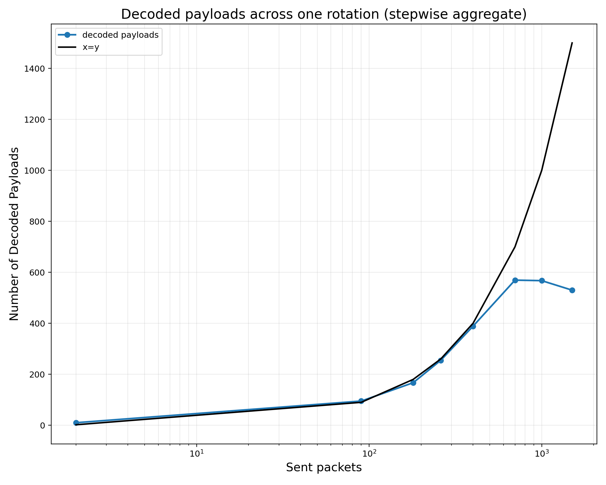
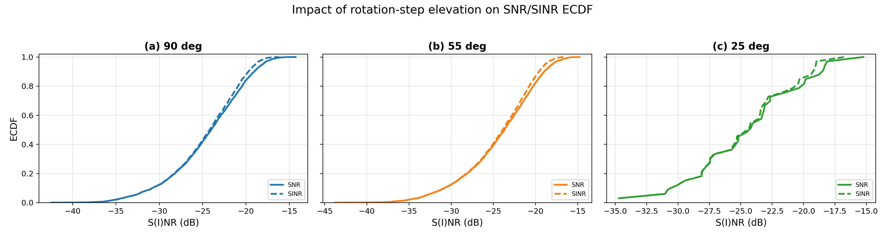
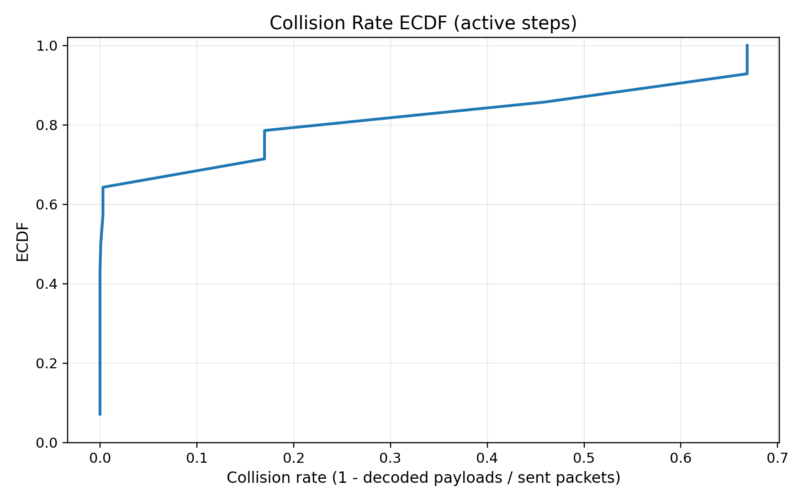
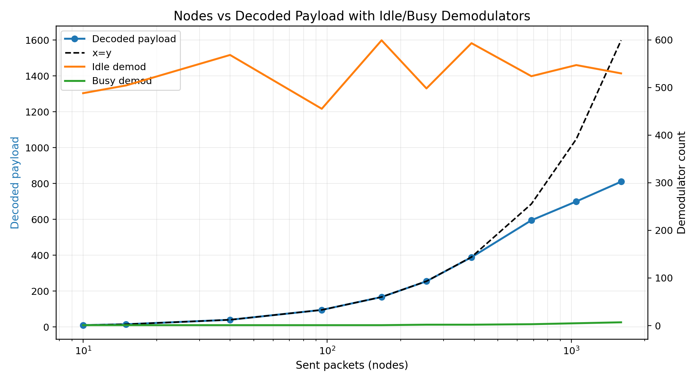
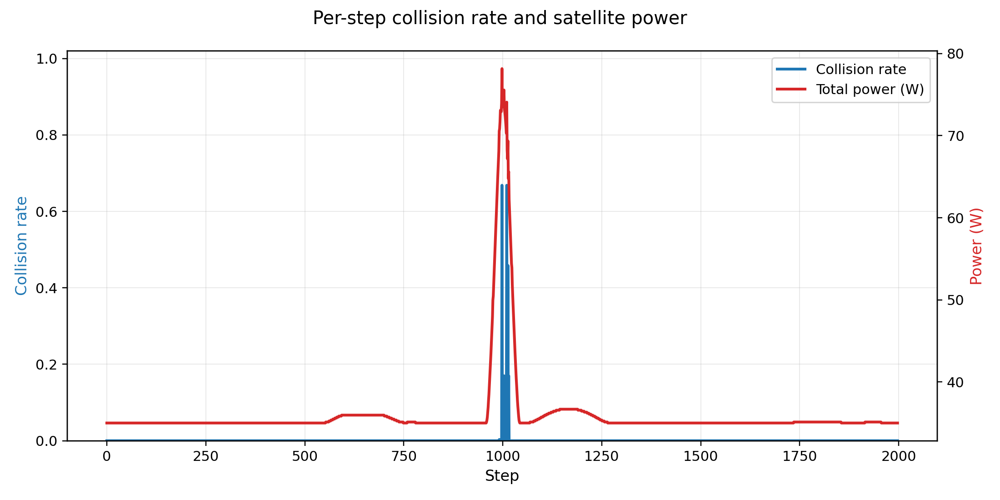

---

# LR-FHSS: Overview and Performance Analysis (2021)
### N. Boquet et al.

## Problem Definition

- Evaluate LEO LR-FHSS uplink performance:
  - reliability (decoded payload)
  - interference (collision, SINR)
  - energy (power)

## Output Metrics

- decoded payload per time & region  
- collision rate  
- SNR / SINR distributions  
- power consumption  

<!--
This slide defines the research problem and evaluation metrics.
marp: true
-->

---

# End-to-End Workflow
### Based on LR-FHSS Framework and 3GPP TR 38.811

## Cross-Layer Pipeline

- Orbit → satellite position  
- Coverage → user distribution  
- Load → active devices  
- Channel → SNR / SINR  
- Decoding → successful packets  
- Power → energy consumption  

<!--
This slide explains the full workflow.
Each stage depends on the previous one.
-->

---

# Satellite Orbit Configuration
### LEO (Low Earth Orbit) Parameters

| Parameter | Value |
|-----------|-------|
| **Altitude** | 600 km |
| **Eccentricity** | 0.001 (nearly circular) |
| **Inclination** | 86.4° (near-polar) |
| **Semi-major Axis** | 6,971 km |
| **Orbital Period** | ~97 minutes |
| **Velocity** | 7,560 m/s |

<!--
Our satellite operates in a Low Earth Orbit at 600 km altitude.
The nearly circular orbit (e=0.001) with near-polar inclination (86.4°) 
provides global coverage, which is ideal for LEO IoT networks like LoRaWAN.
With an orbital period of ~97 minutes, the satellite completes roughly 
15 passes per day. The velocity of 7,560 m/s is typical for LEO constellations.
This configuration is based on Keplerian propagation with two-body dynamics.
-->

---

# Fundamentals of Astrodynamics (Kepler Orbit Propagation)
### D. A. Vallado

$$
n=\sqrt{\frac{\mu}{a^3}}, \quad M(t)=M_0+n(t-t_0)
$$

- $n$: mean motion of the satellite  
- $\mu$: Earth's gravitational parameter  
- $a$: semi-major axis of the orbit  
- $M(t)$: mean anomaly at time $t$  
- $M_0$: mean anomaly at reference time $t_0$  
- $t$: current propagation time  
- $t_0$: reference epoch  

<!--
Keplerian orbit propagation defines satellite motion.
The mean motion $n$ depends on the semi-major axis.
We solve Kepler's equation using Newton-Raphson iteration to find 
the eccentric anomaly, then compute satellite position in inertial coordinates.
This propagation is deterministic and highly accurate for our 600 km LEO orbit.
-->

---

# Orbital Mechanics for Engineering Students
### H. D. Curtis

$$
d(\psi)=\sqrt{(R_E+h)^2+R_E^2-2R_E(R_E+h)\cos\psi}
$$

- $d(\psi)$: slant range from satellite to ground user  
- $R_E$: Earth radius  
- $h$: satellite altitude above Earth surface  
- $R_E+h$: orbital radius from Earth center to satellite  
- $\psi$: Earth-centered angle between subsatellite point and user location  
- $\cos\psi$: captures how link distance changes with user position inside coverage  

<!--
Distance varies with geometry and affects signal strength.
-->

---

# Coverage-Weighted Population Mapping
### Geometry + UN World Population Prospects 2024

1. **Satellite pass:** the beam footprint moves over different countries during each time step.
2. **People under footprint:** I estimate how many people are inside the covered area using UN population data.
3. **Active IoT terminals:** a portion of that covered population is mapped to active LR-FHSS nodes in the simulator.
4. **Uplink burst generation:** those active nodes create packet bursts, which sets the offered load.

---
# Coverage-Weighted Population Mapping
5. **Demodulator usage:** higher offered load activates more onboard demods and increases collision risk.

This slide links geography to traffic behavior in our project:  
**coverage location -> covered population -> active nodes -> burst load -> demod state**.

**Data Source:** UN DESA Population Division, World Population Prospects 2024  
https://population.un.org/wpp/downloads?folder=Documentation&group=Documentation

<!-- ## Mathematical Model

$$
\xi_c(t)=\frac{A_{overlap,c}}{A_c}, \quad
P_{eff}(t)=\sum_c P_c \, \xi_c(t)
$$

**Key Variables:**

- $A_{overlap,c}$: area where satellite footprint intersects country $c$
- $A_c$: total area of country $c$  
- $P_c$: population living in country $c$ (from UN data)
- $P_{eff}(t)$: effective covered population — the number of people who *can be reached* at time $t$
- $\xi_c(t)$: coverage factor (0 to 1) — fraction of country $c$ under the satellite at time $t$ -->

<!--
This slide maps geometric overlap into covered population.
We multiply the coverage fraction by total population to get reachable users.
The sum over all countries gives the instantaneous effective coverage.
-->

---

# A Note on a Simple Transmission Formula (1946)
### H. T. Friis

$$
L_{tot}=20\log_{10}\left(\frac{4\pi d f_c}{c}\right)+A_{atm}
$$

- $L_{tot}$: total large-scale path loss in dB  
- $d$: propagation distance or slant range  
- $f_c$: carrier frequency  
- $c$: speed of light  
- $A_{atm}$: additional atmospheric attenuation in dB  
- $4\pi d f_c / c$: free-space propagation term from the Friis model  

<!--
Channel loss depends on distance and environment.
-->

---

# A Mathematical Theory of Communication (1948)
### C. E. Shannon

$$
N=k_BTB F, \quad \mathrm{SNR}=\frac{P_{sig}}{N}
$$

- $N$: receiver noise power  
- $k_B$: Boltzmann constant  
- $T$: system noise temperature  
- $B$: receiver bandwidth  
- $F$: receiver noise figure or implementation loss factor  
- $P_{sig}$: received signal power  
- $\mathrm{SNR}$: signal-to-noise ratio  

<!--
SNR defines signal quality baseline.
-->

---

# Decoding Evidence
### Offered load versus decoded payload

- Decoded payload rises with load at first, then saturates
- Baseline and combined early-decode-plus-early-drop curves separate where congestion begins
- Deviation from the $x=y$ line highlights decoding loss under congestion

<!--
This figure shows how successful payload delivery diverges from offered traffic.
-->

---

# Channel Quality Evidence
### SNR / SINR across elevation angles

- Higher elevation shifts SNR/SINR toward better operating points
- SINR remains below SNR because of inter-beam interference

<!--
This plot supports the channel-quality discussion with measured ECDFs.
-->

---

# The ALOHA System (1970)
### N. Abramson

$$
\gamma_t=1-\frac{\sum_c Y_{c,t}}{\sum_c n_{c,t}}
$$

- $\gamma_t$: system-level collision or loss ratio at time $t$  
- $\sum_c Y_{c,t}$: total decoded packets summed over all cells  
- $\sum_c n_{c,t}$: total transmitted packets summed over all cells  
- $1-\frac{\sum_c Y_{c,t}}{\sum_c n_{c,t}}$: fraction of packets not successfully decoded  

<!--
Collision aggregated across all users.
-->

---

# Collision Evidence
### Distribution of packet loss from contention

- Most active steps have low collision, but a smaller tail reaches much higher loss
- This tail explains why average performance alone can hide congestion events

<!--
This plot supports the system-level collision discussion.
-->

---

# Study on NR to Support NTN (TR 38.811)
### 3GPP

$$
P_{tot}=P_0+N_{idle}P_{idle}+N_{busy}P_{busy}
$$

- $P_{tot}$: total satellite payload power consumption  
- $P_0$: fixed baseline power independent of traffic  
- $N_{idle}$: number of idle demodulators  
- $P_{idle}$: power consumed by each idle demodulator  
- $N_{busy}$: number of actively processing demodulators  
- $P_{busy}$: power consumed by each busy demodulator  

<!--
Power depends on system load.
-->

---

# Demodulator Evidence
### Resource activation under increasing load

- Busy demodulators grow with traffic, while decoded payload eventually flattens

<!--
This plot links decoding saturation to demodulator allocation.
-->

---

# Power Evidence
### Collision spikes align with temporary power surges

- Power rises when more demodulator resources are activated
- The highest collision event coincides with the strongest short-lived power peak

<!--
This plot links congestion events to power draw.
-->

---

# Conclusion — This Work

| **Contributions** | **Key Findings** |
|------------------|-----------------|
| Unified cross-layer framework | Geometry drives SNR/SINR |
| Integrated orbit, channel, decoding, power | Load drives collision |
| Stepwise, reproducible model | Power depends on demod usage |
| Defendable methodology | Reliability–energy tradeoff |

---

## Final Insight

- geometry → load → interference → decoding → energy  

<!--
Left shows contributions, right shows observations.
-->
