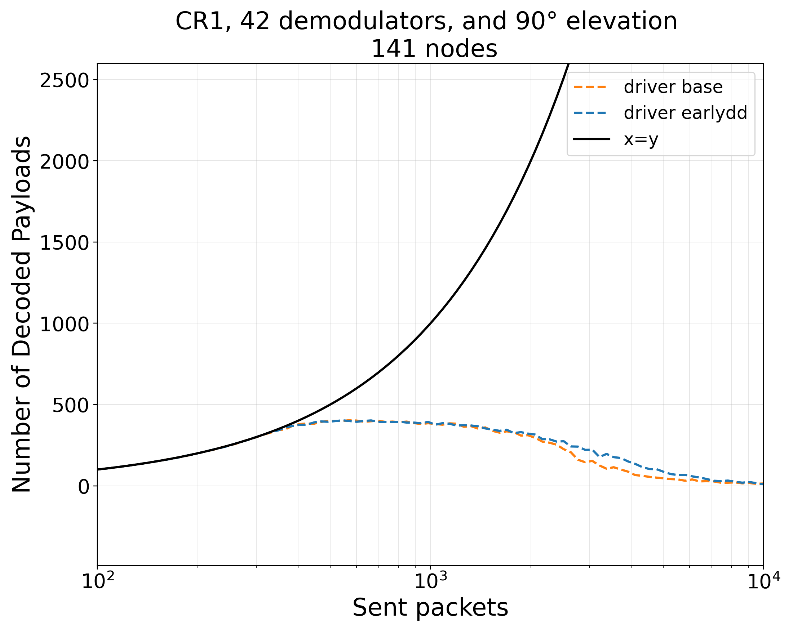
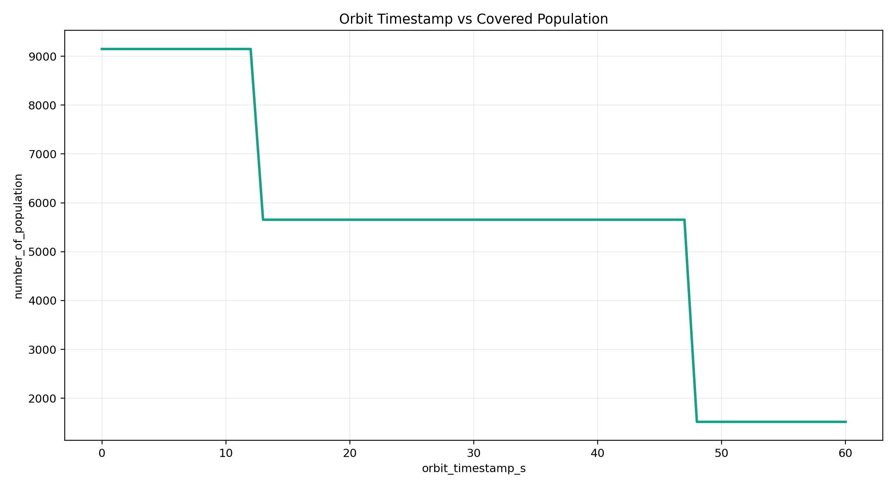
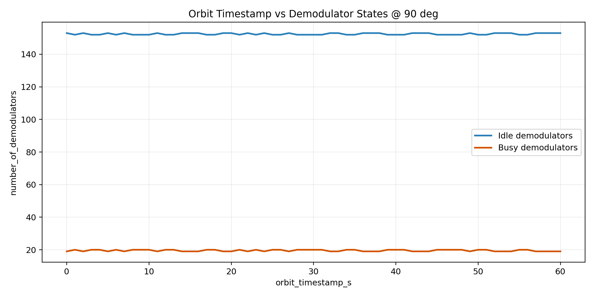
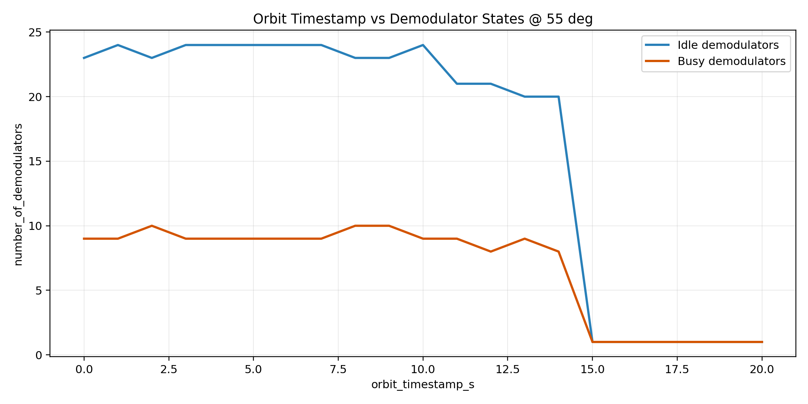
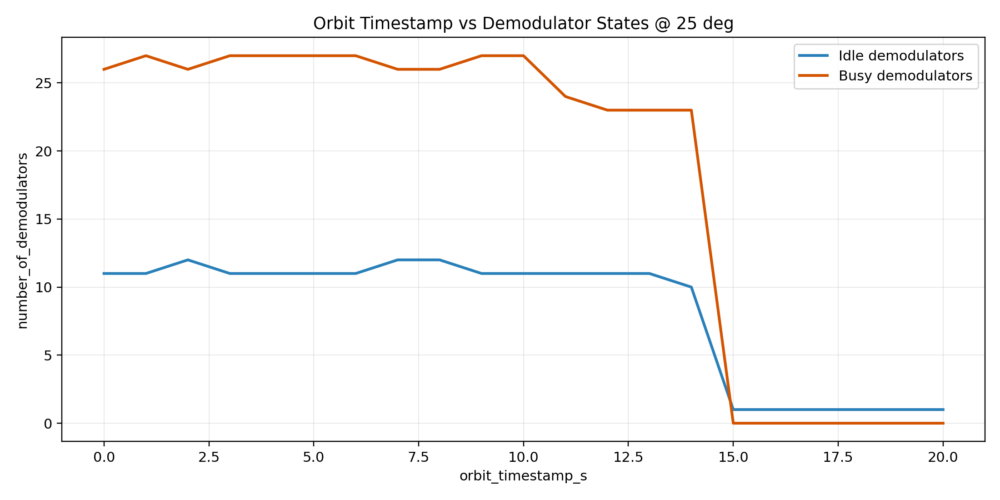
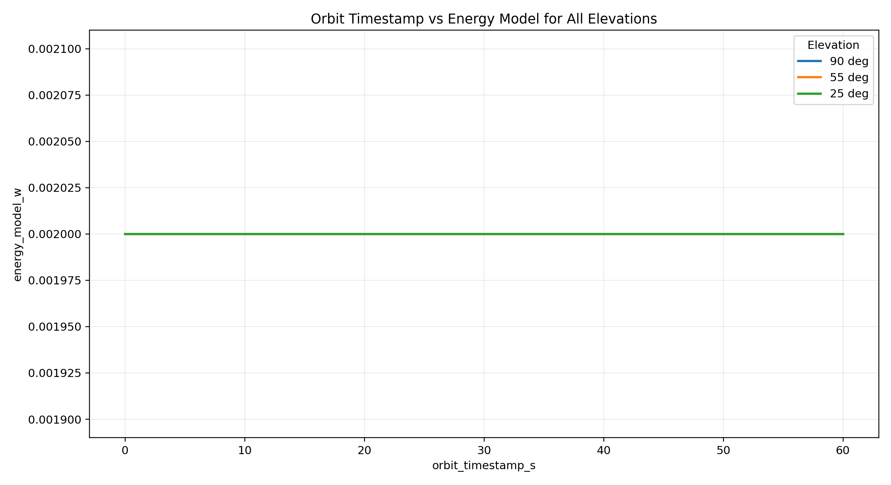

---
marp: true
paginate: true
math: katex
---

# LR-FHSS in LEO
### Cross Layered Simulation

- Focus: equations, assumptions, and measurable outputs
- Inputs: updated population data + satellite geometry
- Outputs: nodes, demod states, decoded packets, elevation effects, energy

---

# Problem Statement
### What Is Estimated at Each Step

Given satellite state at step $t$, estimate:

1. covered population $P_{\text{cov}}(t)$
2. active nodes $N_{\text{node}}(t)$
3. demodulator pool $N_{\text{demod}}(t)$
4. elevation-conditioned load and decoding behavior
5. busy/idle/sleep demod split and power

---

# Workflow

- Orbit propagation gives future satellite position.
- Satellite position gives footprint size on Earth.
- Footprint over population map gives covered population.
- Covered population is converted to estimated nodes and demodulators.
- Elevation scenarios convert load to busy/idle/sleep demod states.
- Demod states are converted to predicted energy and decode behavior.

---

# Orbit Mean Motion

$$
n=\sqrt{\frac{\mu}{a^3}}
$$

- Symbols: $n$ mean motion, $\mu$ Earth gravitational parameter, $a$ semi-major axis.
- Ref: Orbital mechanics (Vallado) https://doi.org/10.1007/978-1-4939-0802-8

---

# Mean Anomaly Update

$$
M(t)=M_0+n(t-t_0)
$$

- Symbols: $M(t)$ anomaly at time $t$, $M_0$ anomaly at reference epoch $t_0$, $n$ mean motion.
- Ref: Orbital mechanics (Vallado) https://doi.org/10.1007/978-1-4939-0802-8

---

# Horizon Central Angle

$$
\psi_h=\arccos\left(\frac{R_E}{r_{\text{orb}}}\right)
$$

- Symbols: $\psi_h$ horizon central angle, $R_E$ Earth radius, $r_{\text{orb}}$ orbital radius.
- Ref: NTN geometry context https://www.3gpp.org/DynaReport/38.811.htm

---

# Geometric Footprint Radius

$$
R_{\text{geo}}=R_E\psi_h
$$

- Symbols: $R_{\text{geo}}$ geometric footprint radius, $R_E$ Earth radius, $\psi_h$ horizon central angle.
- Ref: NTN geometry context https://www.3gpp.org/DynaReport/38.811.htm

---

# Effective Footprint Radius

$$
R_{\text{fp}}(t)=\min\left(R_{\text{geo}}(t),\;R_{\text{cfg}}\frac{h(t)}{h_{\text{cfg}}}\right)
$$

- Symbols: $R_{\text{fp}}(t)$ effective footprint radius, $R_{\text{cfg}}$ configured radius.
- Symbols: $h(t)$ current altitude, $h_{\text{cfg}}$ reference altitude.
- Ref: Implementation rule in `modules/satellite_stepper.py`

---

# Covered Population

$$
P_{\text{cov}}(t)=\sum_i p_i \,\mathbf{1}[d_i(t)\le R_{\text{fp}}(t)]
$$

- Symbols: $P_{\text{cov}}(t)$ covered population, $p_i$ population at catalog point $i$.
- Symbols: $d_i(t)$ distance from footprint center to point $i$, $\mathbf{1}[\cdot]$ indicator.
- Ref: Natural Earth populated places https://naciscdn.org/naturalearth/10m/cultural/ne_10m_populated_places.zip

---

# Node Mapping

$$
N_{\text{node}}(t)=\text{round}\left(P_{\text{cov}}(t)\rho_{\text{node}}\right)
$$

- Symbols: $N_{\text{node}}(t)$ estimated active nodes, $\rho_{\text{node}}$ node/population ratio.
- Ref: Implementation rule in `modules/satellite_stepper.py`

---

# Demod Mapping

$$
N_{\text{demod}}(t)=\text{round}\left(P_{\text{cov}}(t)\rho_{\text{demod}}\right)
$$

- Config values: $\rho_{\text{node}}=10^{-5}$, $\rho_{\text{demod}}=10^{-2}$.
- Symbols: $N_{\text{demod}}(t)$ estimated demodulator pool, $\rho_{\text{demod}}$ demod/population ratio.
- Ref: Implementation rule in `modules/satellite_stepper.py`

---

# Mean Slant Range per Elevation

$$
\bar d_e(t)=\frac{1}{N_e(t)}\sum_{u=1}^{N_e(t)} d_{u,e}(t)
$$

- Symbols: $e$ elevation bin, $N_e(t)$ users in that bin.
- Symbols: $d_{u,e}(t)$ user-$u$ slant range, $\bar d_e(t)$ mean slant range.
- Ref: Slant-range impact concept (Friis distance dependence) https://doi.org/10.1109/JRPROC.1946.234568

---

# Relative Path-Loss Pressure

$$
\phi_e(t)=\left(\frac{\bar d_e(t)}{d_{\text{ref}}}\right)^2
$$

- Symbols: $\phi_e(t)$ path-loss pressure factor, $\bar d_e(t)$ mean slant range.
- Symbols: $d_{\text{ref}}$ reference range (in code, tied to satellite altitude).
- Ref: Free-space distance-loss relation (Friis) https://doi.org/10.1109/JRPROC.1946.234568

---

# Elevation Load Factor

$$
f_e(t)=N_e(t)\cdot \alpha_{\text{act}}\cdot \phi_e(t)\cdot 0.01N_{\text{demod}}(t)
$$

- Symbols: $f_e(t)$ load factor, $\alpha_{\text{act}}$ activity ratio.
- Symbols: $N_{\text{demod}}(t)$ demod pool size, $N_e(t)$ users at elevation bin $e$.
- Ref: Implementation rule in `modules/satellite_stepper.py`

---

# Busy Demodulators

$$
N_{\text{busy},e}(t)=\min\left(N_{\text{demod}}(t),\lceil f_e(t)\rceil\right)
$$

- Symbols: $N_{\text{demod}}(t)$ total demodulators at step $t$.
- Symbols: $N_{\text{busy},e}$ busy demods at elevation $e$, $f_e(t)$ load factor.
- Ref: Implementation model in your code `modules/satellite_stepper.py`

---

# Remaining Demodulators

$$
N_{\text{rem},e}(t)=N_{\text{demod}}(t)-N_{\text{busy},e}(t)
$$

- Symbols: $N_{\text{rem},e}$ demods not busy, $N_{\text{demod}}$ total demods.
- Ref: Implementation model in your code `modules/satellite_stepper.py`

---

# Sleep Demodulators

$$
N_{\text{sleep},e}(t)=\text{round}\left(\beta_{\text{sleep}}N_{\text{rem},e}(t)\right)
$$

- Symbols: $N_{\text{sleep},e}$ sleep demods, $\beta_{\text{sleep}}$ sleep ratio.
- Ref: Implementation model in your code `modules/satellite_stepper.py`

---

# Idle Demodulators

$$
N_{\text{idle},e}(t)=N_{\text{rem},e}(t)-N_{\text{sleep},e}(t)
$$

- Symbols: $N_{\text{idle},e}$ idle demods, $N_{\text{rem},e}$ remaining demods.
- Ref: Implementation model in your code `modules/satellite_stepper.py`

---

# Power Model

$$
P_e(t)=P_0+N_{\text{idle},e}(t)P_{\text{idle}}+N_{\text{busy},e}(t)P_{\text{busy}}
$$

- Symbols: $P_e(t)$ total modeled power for elevation scenario $e$.
- Symbols: $P_0$ baseline power, $P_{\text{idle}}$ idle demod power, $P_{\text{busy}}$ busy demod power.
- Symbols: $N_{\text{idle},e}(t)$ and $N_{\text{busy},e}(t)$ are stepwise demod state counts.
- Current constants: $P_0=2$ mW, $P_{\text{idle}}=9$ mW, $P_{\text{busy}}=100$ mW.
- Ref: power-state modeling basis https://tnm.engin.umich.edu/wp-content/uploads/sites/353/2017/12/2006.10.Reducing-idle-mode-power-in-software-defined-radio-terminals_ISLPED-2006.pdf

---

# Future Prediction 
### Predicting Next Time Steps

Goal: predict busy demodulators and energy at future horizon $t+\Delta$.

1. Generate future satellite states by stepping orbit index forward.
2. For each future step, recompute footprint and covered population.
3. Map covered population to future `calculated_nodes` and `calculated_demodulators`.
4. For each elevation (90/55/25), estimate future busy/idle/sleep states.
5. Convert those states to future energy using the same power constants.

---
# One-Position Decode Results
### Elevation Curves (90 deg)

---
# One-Position Decode Results
### Elevation Curves (55 deg)

---

# One-Position Decode Results
### Elevation Curve (25 deg)

- Same demod budget, stronger geometry penalty at lower elevation.

---

# Satellite Stepper Outputs
### Population and Resource Dynamics

- Per step: covered population, nodes, and demod count.

---

# Demodulator State Evidence
### Busy/Idle vs Orbit Timestamp (90 deg)

---

# Demodulator State Results
### Busy/Idle vs Orbit Timestamp (55 deg)

---

# Demodulator State Results
### Busy/Idle vs Orbit Timestamp (25 deg)

---

# Energy Model Results (90, 55 and 25 deg)

- Energy follows geometry-driven demod state transitions.

---

# Main Takeaways

1. Geometry controls coverage and distance.
2. Coverage controls node/demod provisioning.
3. Elevation changes distance and busy occupancy.
4. Busy occupancy is the main power driver.
5. One-position decode plots are consistent with this chain.

---

# Citable Paper Sources (URLs)

- LR-FHSS overview paper: https://doi.org/10.1109/MCOM.001.2000627
- 3GPP NTN reference (TR 38.811): https://www.3gpp.org/DynaReport/38.811.htm
- Friis transmission formula: https://doi.org/10.1109/JRPROC.1946.234568
- Shannon communication theory: https://doi.org/10.1002/j.1538-7305.1948.tb01338.x
- ALOHA system paper: https://doi.org/10.1145/1478462.1478502

---

# Citable Data Sources (URLs)

- Natural Earth populated places: https://naciscdn.org/naturalearth/10m/cultural/ne_10m_populated_places.zip
- Natural Earth countries: https://naciscdn.org/naturalearth/10m/cultural/ne_10m_admin_0_countries.zip
- Natural Earth lakes: https://naciscdn.org/naturalearth/10m/physical/ne_10m_lakes.zip
- Natural Earth rivers: https://naciscdn.org/naturalearth/10m/physical/ne_10m_rivers_lake_centerlines.zip
- Demod power baseline reference: https://tnm.engin.umich.edu/wp-content/uploads/sites/353/2017/12/2006.10.Reducing-idle-mode-power-in-software-defined-radio-terminals_ISLPED-2006.pdf

