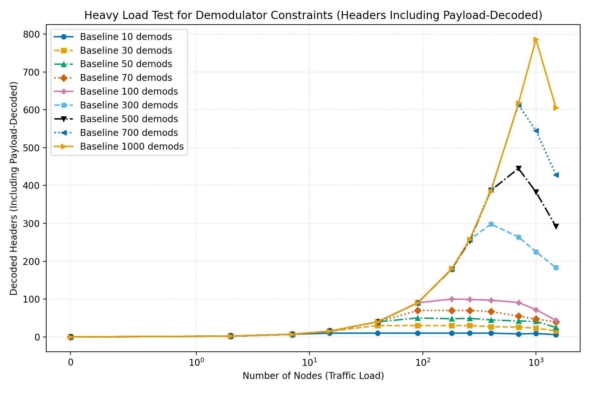
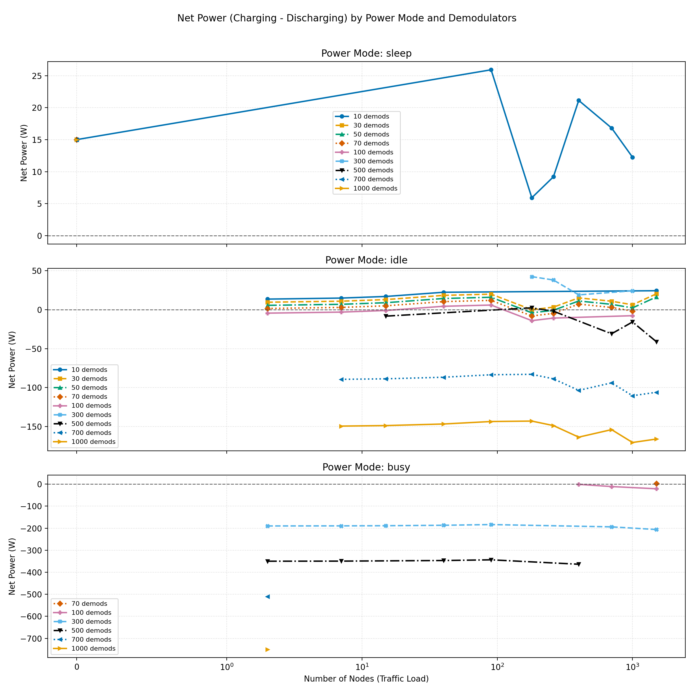
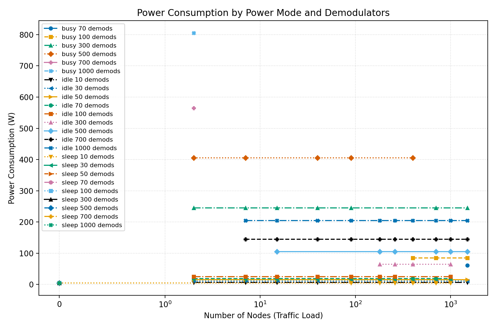
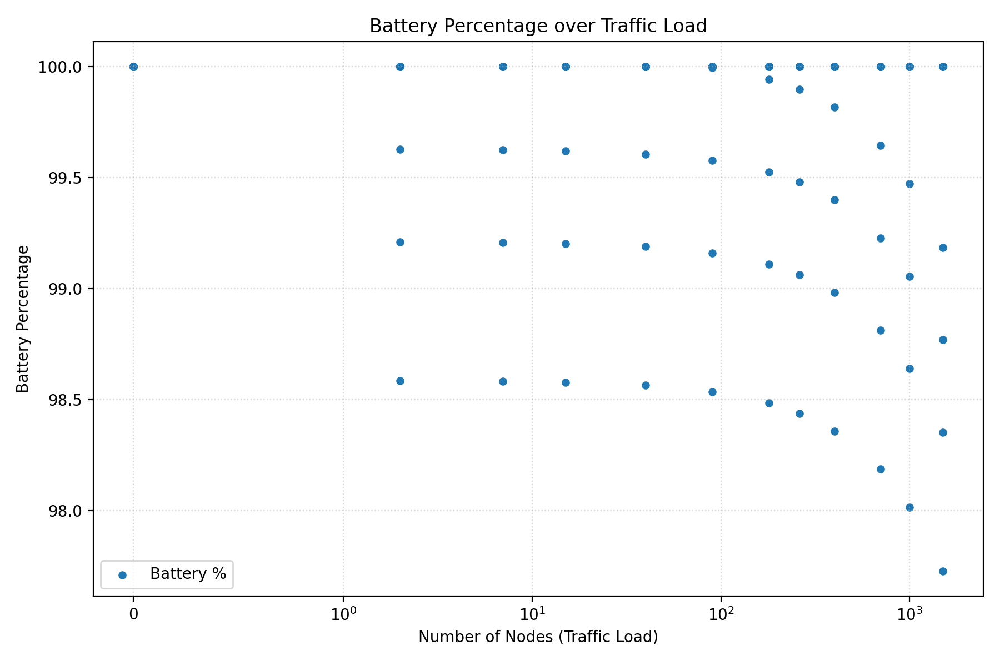

---
marp: true
---

# Paper Presentation: Cross-Layer LR-FHSS and Multi-Beam LEO Integration

## Slide 1: Title
- Cross-Layer Integration of LR-FHSS, Multi-Beam LEO Visibility, and Battery-Aware Demodulator Allocation
- Sat Naing Tun
- Project: LRFHSS_MultiBeam_Integration

<!-- **Speaking script**
Good [morning/afternoon]. This presentation summarizes our cross-layer study that integrates LR-FHSS decoding, multi-beam LEO visibility, and battery-aware demodulator control in one simulation framework. -->

---

## Slide 2: Motivation
- Massive IoT over LEO needs scalable random access and reliable decoding.
- Decoder resources are limited onboard satellites.
- Energy availability depends on visibility and battery state.
- Communication and energy must be analyzed jointly.
<!-- 
**Speaking script**
Most studies optimize only one layer, but in satellites, communication performance and onboard energy are tightly coupled. This motivates a joint model instead of isolated analyses. -->

---

## Slide 3: Problem Statement
- Inputs per step: node load, requested demodulators, visibility, battery SoC.
- Outputs per step: mode, allocated demodulators, power, net energy, updated SoC.
- Goal: maximize decoding performance while maintaining energy feasibility.
<!-- 
**Speaking script**
At each simulation step, we decide operation mode and demodulator allocation using load, visibility, and battery state, then evaluate both decoding success and energy impact. -->

---

## Slide 4: Contributions
- Unified simulation workflow combining LR-FHSS decoding and energy model.
- Battery-aware control policy with sleep/idle/busy modes.
- Data-backed evaluation over heavy-load settings.
- Literature-supported energy-model consistency validation.
<!-- 
**Speaking script**
The key novelty is not only the workflow integration but also a formal consistency check showing why the energy model is scientifically reasonable with respect to prior work. -->

---

## Slide 5: End-to-End Workflow
- Initialize parameters
- Compute orbit
- Generate visibility windows
- Generate nodes and packets
- Transmit fragments and detect collisions
- Allocate demodulators and decode
- Update power and battery state
- Export metrics and plots

<!-- **Speaking script**
This is the full loop we execute for each operating point. The important part is the feedback: allocation affects power, and power affects future allocation through battery SoC. -->

---

## Slide 6: Key Equations (Utilization and Consumption)
- Demodulator utilization:
  - rho = min(1, N_t / (8D))
- Mode-dependent power:
  - sleep: P_sat = 5
  - idle: P_sat = 5 + D(0.12 + 0.08 rho)
  - busy: P_sat = 5 + D(0.25 + 0.55 rho)

<!-- **Speaking script**
We use a bounded utilization model and an affine, mode-dependent power law. This captures low-to-high activity transitions while keeping the model simple and controllable. -->

---

## Slide 7: Key Equations (Generation and Battery)
- Generation model:
  - P_gen = A_panel * G_sun * eta_panel
- Net power:
  - P_net = P_ch - P_dis = P_gen - P_total
- SoC update (energy integration with charge/discharge efficiency):
  - B_{t+1} = clip(B_t + 100 * DeltaE / C_Wh, 0, 100)

<!-- **Speaking script**
Visibility gates generation, and the battery evolves from net power after efficiency losses. The clip operation enforces physical SoC bounds between 0 and 100 percent. -->

---

## Slide 8: CC-CV and Model Assumptions
- CC-CV means constant-current then constant-voltage charging.
- Near full SoC, charging acceptance tapers.
- Model captures this by reducing charge acceptance near high SoC.
- This is first-order and system-level, not full electrochemical simulation.

<!-- **Speaking script**
We intentionally use a first-order CC-CV-inspired taper to represent practical charge saturation behavior, without adding heavy electrochemical complexity. -->

---

## Slide 9: Energy-Model Consistency Validation (Summary)
- Proposition 1: utilization and consumption are bounded.
- Proposition 2: charge/discharge complementarity follows EPS balance.
- Proposition 3: SoC recurrence is stable and dimensionally consistent.
- Correlation with literature is validated for each model block.

<!-- **Speaking script**
These propositions justify that the model is physically coherent and mathematically stable. They are the bridge between implementation convenience and scientific defensibility. -->

---

## Slide 10: Experimental Setup
- Nodes: {0, 2, 7, 15, 40, 90, 180, 260, 400, 700, 1000, 1500}
- Requested demodulators: {10, 30, 50, 70, 100, 300, 500, 700, 1000}
- Monte Carlo runs per point (>= 50)
- Visibility frame selected from first window

<!-- **Speaking script**
This heavy-load grid is designed to expose bottlenecks and tradeoffs. It spans very low to very high traffic, with conservative to aggressive demodulator budgets. -->

---

## Slide 11: Main Results
<table>
<tr>
<td width="42%">

- Max decoded header+payload: **786**
- Point: **1000 nodes, 1000 demods**
- At 1500 nodes: **6 -> 605** decoded H+P (10 -> 1000 demods)
- Decoder availability remains the main bottleneck

</td>
<td width="58%">

</td>
</tr>
</table>

<!-- **Speaking script**
Decoding improves with more demodulators, but scaling is sublinear under congestion. This confirms demodulator constraints as a dominant bottleneck at high load. -->

---

## Slide 12: Energy-Performance Tradeoff
<table>
<tr>
<td width="42%">

- First negative net power: **2 nodes, 500 demods**
- Minimum battery in sweep: **97.73%**
- Point: **1500 nodes, 1000 demods**
- Throughput gain trades off with energy sustainability

</td>
<td width="58%">

</td>
</tr>
</table>

<!-- 
**Speaking script**
This is the central tradeoff: adding demodulators helps throughput but can move the platform into energy deficit, which is risky for longer mission operation. -->

---

## Slide 13: High-Load Snapshot (1500 nodes)
<table>
<tr>
<td width="42%">

- 100 demods: decoded 44, battery 100.00%
- 300 demods: decoded 183, battery 99.19%
- 500 demods: decoded 292, battery 98.77%
- 700 demods: decoded 428, battery 98.35%
- 1000 demods: decoded 605, battery 97.73%

</td>
<td width="58%">

 

</td>
</tr>
</table>

<!-- **Speaking script**
At the highest load, increasing demodulators gives clear decoding gains, but collision counts remain high and battery drops more as power demand increases. -->

---

## Slide 14: References Used for Energy Proof
- Fan et al., ISCA 2007 (power provisioning)
- Barroso and Holzle, IEEE Computer 2007 (energy proportionality)
- Porras-Hermoso et al., Acta Astronautica 2021 (spacecraft EPS modeling)
- Liu et al., J. Energy Storage 2020 (CC-CV behavior)
- Movassagh et al., Energies 2021 (SoC integration errors)
- Shakoor et al., Discover Energy 2025 (CubeSat EPS context)
<!-- 
**Speaking script**
These references are cited only where model assumptions directly correlate with established methods, ensuring citation accuracy and scientific integrity. -->

---

## Slide 15: Conclusion and Next Work
- Cross-layer integration is necessary for realistic LEO IoT design.
- Decoder scaling must be balanced with battery and generation limits.
- Next steps:
  - Report mean, variance, and confidence intervals
  - Elevation-angle sweep experiments
  - Adaptive demodulator policies (battery-aware)

<!-- **Speaking script**
In summary, the framework demonstrates a practical path for jointly optimizing communication capacity and energy sustainability. Next, we will add statistical robustness and adaptive control policies. -->
