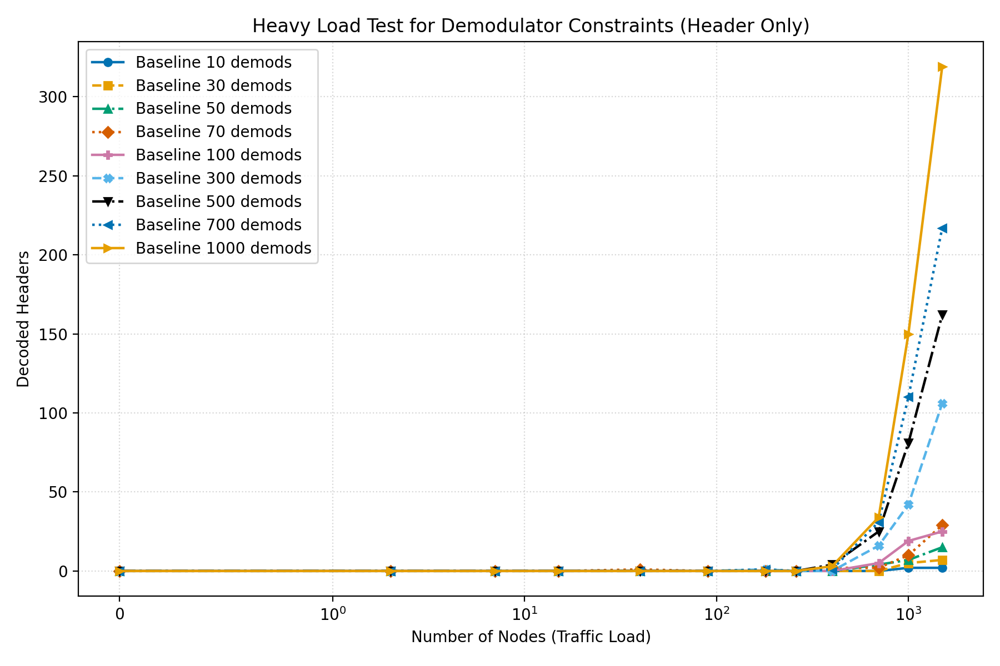
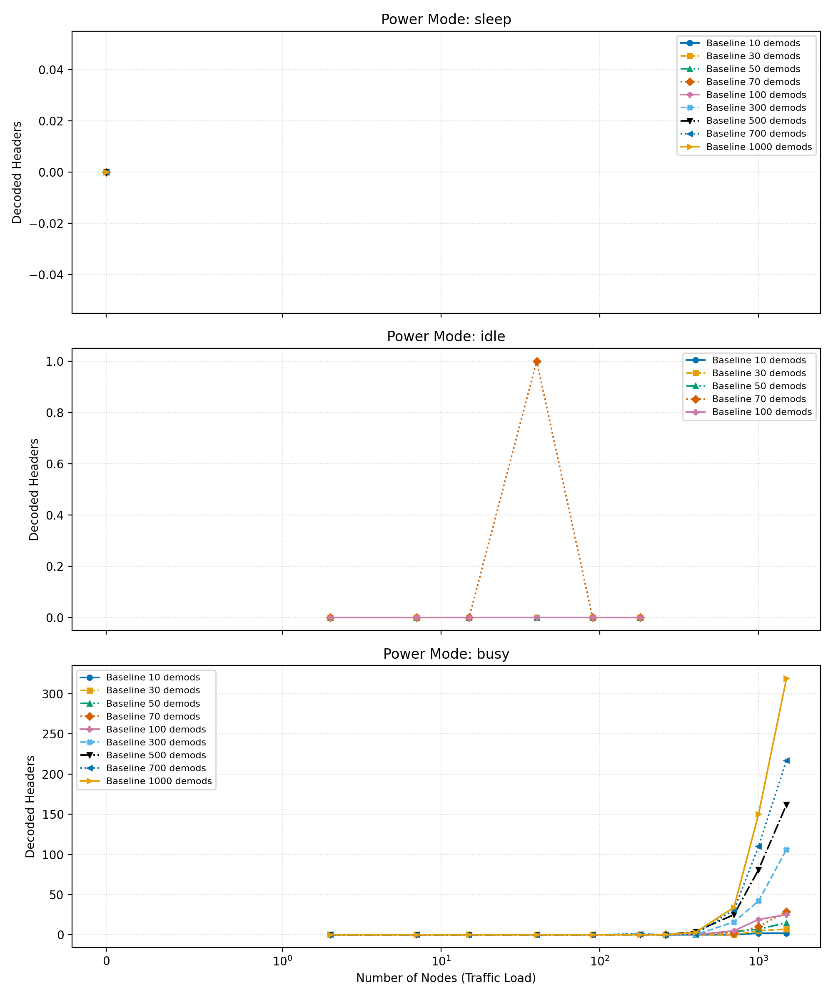
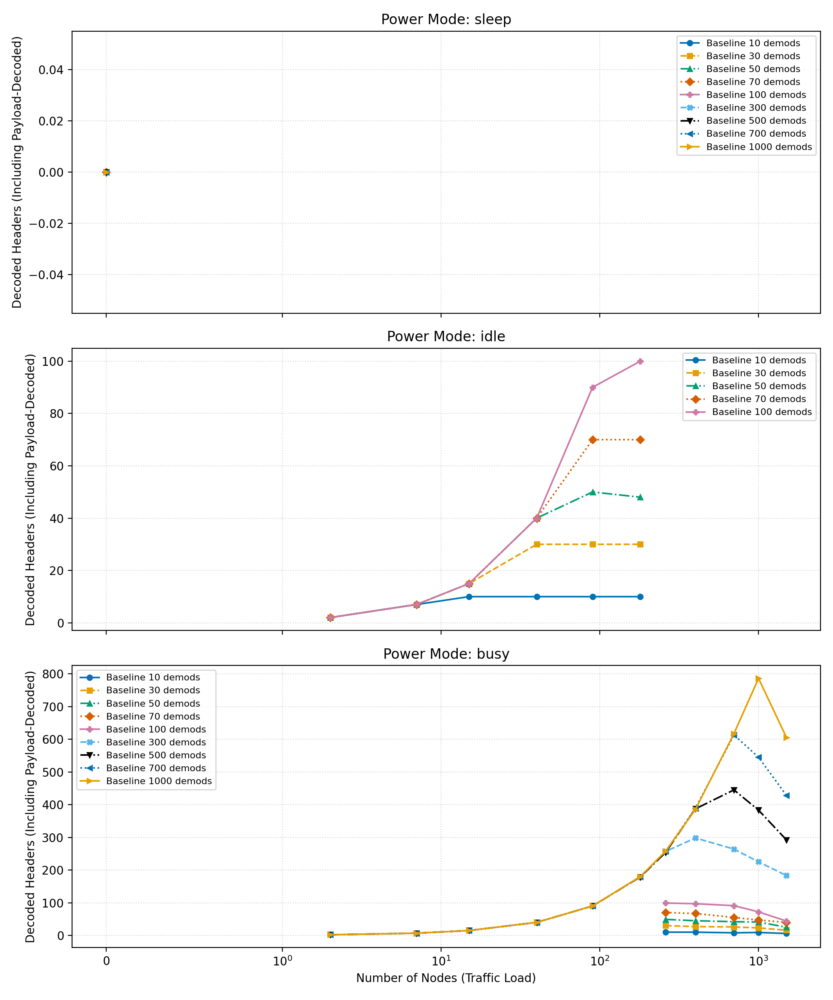

# Detailed Theory
## LR-FHSS + Power Coupling

<!--
Speech script:
This detailed deck is equation-first.
I will define symbols, derive each block, and then combine the blocks into a final recurrence.
-->

---

## Symbols (Core)
- $N$: node load
- $D_{\text{req}}$: requested demods
- $D$: allocated demods
- $T$: traffic demand per step
- $u$: utilization
- $V$: visibility (0/1)
- $B_t$: battery SoC
- $H_{\text{hdr}}$: decoded headers (header-only)
- $H_{\text{inc}}$: decoded headers including payload-decoded packets

<!--
Speech script:
These are the communication and state variables.
They form the input to each simulation step.
-->

---

## Symbols (Power)
- $P_0$: baseline platform power
- $P_{\text{cons}}$: consumption power
- $P_{\text{solar}}$: solar array rating
- $\eta_{\text{pc}}$: power conditioning efficiency
- $P_{\text{gen}}$: generated power
- $P_{\text{net}}$: battery-side net power
- $C_{\text{Wh}}$: battery capacity

<!--
Speech script:
These are the power-system parameters and outputs.
Keep this slide as reference for the remaining equations.
-->

---

## Code Trace (Symbols to `workflow.py`)
- $N$ -> `nodes`
- $D_{\text{req}}$ -> `requested_demods`
- $D$ -> `allocated_demods`
- $m_t$ -> `p_mode`
- $V$ -> `visible`
- $T$ -> `tx_count`
- $H_{\text{hdr}}$ -> `decoded_headers`
- $H_{\text{inc}}$ -> `decoded_headers_including_payloads`
- $u$ -> `compute_demod_utilization(...)`
- $P_{\text{cons}}$ -> `power_consumption`
- $P_{\text{net}}$ -> `net_power_watts`
- $B_t, B_{t+1}$ -> `battery_percent_scenario`, `updated_battery_percent`

<!--
Speech script:
This slide maps each equation symbol to the exact implementation variable.
It helps reviewers verify that the math and code are consistent.
-->

---

## 1) Policy Equation
$$
m_t=
\begin{cases}
\text{sleep}, & B_t\le B_{\text{low}} \;\text{or}\; V=0 \;\text{or}\; N=0 \;\text{or}\; D=0\\
\text{idle}, & B_t<B_{\text{idle}}\\
\text{idle}, & N<200 \;\text{and}\; D\le D_{\text{hi}}\\
\text{busy}, & \text{otherwise}
\end{cases}
$$
Label: Mode-selection policy.
Variables: $m_t$ operating mode, $B_t$ battery SoC (%), $B_{\text{low}}$ low-battery threshold, $B_{\text{idle}}$ idle threshold, $V$ visibility flag, $N$ node load, $D$ allocated demods, $D_{\text{hi}}$ high-charge demod threshold.

<!--
Speech script:
Mode is decided first.
Battery safety, visibility, no traffic, or no allocated demods can force sleep.
Otherwise, threshold logic separates idle and busy operation, including low-load idle.
-->

---

## 2) Allocation Equation
$$
D=
\begin{cases}
0, & m_t=\text{sleep}\\
D_{\text{req}}, & \text{idle/busy}
\end{cases}
$$
Label: Demod allocation rule.
Variables: $D$ allocated demods, $D_{\text{req}}$ requested demods, $m_t$ operating mode.

Why:
- Sleep disables demods.
- Active modes use requested capacity.

<!--
Speech script:
Mode becomes hardware allocation here.
This is the bridge from policy to decoding capability.
-->

---

## 3) Utilization Equation
$$
u=\min\!\left(1,\frac{T}{kD}\right)
$$
Label: Utilization equation.
Variables: $u$ utilization, $T$ traffic demand per step, $k$ per-demod step capacity, $D$ allocated demods.

Interpretation:
- $u\approx 0$: underloaded
- $u\approx 1$: saturated

<!--
Speech script:
Utilization compares demand to demod capacity.
This gives a normalized stress variable between zero and one.
-->

---

## 4) Consumption Equation
$$
P_{\text{cons}}=
\begin{cases}
P_0, & \text{sleep}\\
P_0 + D(a_i+b_i u), & \text{idle}\\
P_0 + D(a_b+b_b u), & \text{busy}
\end{cases}
$$
Label: Receiver power-consumption model.
Variables: $P_{\text{cons}}$ receiver power draw, $P_0$ baseline platform power, $D$ allocated demods, $u$ utilization, $(a_i,b_i)$ idle coefficients, $(a_b,b_b)$ busy coefficients.

<!--
Speech script:
Sleep is baseline-only power.
Idle and busy add demod power, scaled by utilization.
Busy coefficients are larger than idle by design.
-->

---

## 5) Generation Equation
$$
P_{\text{gen}}=V P_{\text{solar}}\eta_{\text{pc}}
$$
Label: Solar generation model.
Variables: $P_{\text{gen}}$ generated power, $V$ visibility flag, $P_{\text{solar}}$ panel rating, $\eta_{\text{pc}}$ power-conditioning efficiency.

Surplus:
$$
S=P_{\text{gen}}-P_{\text{cons}}
$$
Label: Surplus/deficit power.
Variables: $S$ surplus power, $P_{\text{gen}}$ generated power, $P_{\text{cons}}$ consumption power.

<!--
Speech script:
Visibility gates generation.
Surplus is the key sign variable:
positive means potential charging, negative means required discharging.
-->

---

## 6) Charge Acceptance
$$
\alpha(B_t)=
\begin{cases}
1, & B_t<90\\
0.5, & 90\le B_t<95\\
0.25, & 95\le B_t<99\\
0, & B_t\ge 99
\end{cases}
$$
Label: SoC-dependent charge acceptance.
Variables: $\alpha(B_t)$ charge-acceptance scale, $B_t$ battery SoC.

<!--
Speech script:
This captures CV-like taper near full battery.
It limits accepted charging power as SoC approaches 100 percent.
-->

---

## 7) Battery-Side Power Branch
$$
P_{\text{ch}}=\min(\max(S,0),P_{\text{ch,max}}\alpha(B_t))
$$
Label: Charging branch equation.
Variables: $P_{\text{ch}}$ charging power, $S$ surplus power, $P_{\text{ch,max}}$ max charging power, $\alpha(B_t)$ charge-acceptance scale, $B_t$ battery SoC.
$$
P_{\text{dis}}=\max(-S,0)
$$
Label: Discharging branch equation.
Variables: $P_{\text{dis}}$ discharging power, $S$ surplus power.
$$
P_{\text{net}}=P_{\text{ch}}-P_{\text{dis}}
$$
Label: Net battery-side power.
Variables: $P_{\text{net}}$ net battery power, $P_{\text{ch}}$ charging power, $P_{\text{dis}}$ discharging power.

<!--
Speech script:
This is a piecewise branch written compactly.
Only one branch is active at a time:
charging branch for positive surplus, discharging branch for negative surplus.
-->

---

## 8) Battery Energy Update
$$
\Delta E=
\eta_{\text{ch}}\max(P_{\text{net}},0)\Delta t
-\frac{1}{\eta_{\text{dis}}}\max(-P_{\text{net}},0)\Delta t
$$
Label: Battery energy-change per step.
Variables: $\Delta E$ battery energy change, $P_{\text{net}}$ net battery power, $\eta_{\text{ch}}$ charging efficiency, $\eta_{\text{dis}}$ discharging efficiency, $\Delta t$ step duration.

$$
B_{t+1}=\text{clip}_{[0,100]}
\left(B_t+100\frac{\Delta E}{C_{\text{Wh}}}\right)
$$
Label: SoC update equation.
Variables: $B_{t+1}$ next-step SoC, $B_t$ current SoC, $\Delta E$ battery energy change, $C_{\text{Wh}}$ battery capacity (Wh), $\text{clip}_{[0,100]}$ bound operator.

<!--
Speech script:
We integrate power over step duration to get energy change.
Then convert energy to SoC percentage.
Clip ensures physically valid SoC bounds.
-->

---

## 9) Combined Derivation
$$
(N,D_{\text{req}},V,B_t)
\rightarrow m_t
\rightarrow D
\rightarrow u
\rightarrow P_{\text{cons}}
\rightarrow S
\rightarrow P_{\text{net}}
\rightarrow B_{t+1}
$$
Label: End-to-end recurrence chain.
Variables: $N$ node load, $D_{\text{req}}$ requested demods, $V$ visibility, $B_t$ current SoC, $m_t$ mode, $D$ allocated demods, $u$ utilization, $P_{\text{cons}}$ consumption power, $S$ surplus power, $P_{\text{net}}$ net battery power, $B_{t+1}$ next-step SoC.

Implementation note:
- Current code evaluates one-step SoC per scenario and resets battery to initial value for each sweep point.

<!--
Speech script:
This one-line chain is the full algorithm.
Every block is deterministic once parameters are set.
In code, this chain is applied as a one-step scenario update rather than a multi-step temporal rollout across scenarios.
-->

---

## 10) Piecewise Net Power Result
From $S=P_{\text{gen}}-P_{\text{cons}}$:

$$
P_{\text{net}}=
\begin{cases}
\min(S,P_{\text{ch,max}}\alpha(B_t)), & S\ge 0\\
S, & S<0
\end{cases}
$$
Label: Piecewise closed form for net power.
Variables: $P_{\text{net}}$ net battery power, $S$ surplus power, $P_{\text{ch,max}}$ max charging power, $\alpha(B_t)$ charge-acceptance scale, $B_t$ battery SoC.

Meaning:
- Positive surplus may still be charge-limited.

<!--
Speech script:
This is the most important derived simplification.
When surplus is positive, charging can still be capped by acceptance.
When surplus is negative, net power simply follows deficit.
-->

---

## 11) Applicability
Use when:
- fast trade studies are needed
- policy comparisons are needed
- interpretable model is preferred

Avoid alone when:
- thermal-electrochemical detail is required
- high-fidelity orbit irradiance is required

<!--
Speech script:
This model is intentionally lightweight.
It is great for control and system-level trade space analysis.
It should be complemented by high-fidelity models for final verification.
-->

---

## 12) Validation Checklist
1. Sleep consumption is constant.
2. Active-mode consumption rises with $u$ and $D$.
3. If $V=0$, then $P_{\text{gen}}=0$.
4. $B_{t+1}$ always in $[0,100]$.

<!--
Speech script:
These checks are quick sanity tests for implementation correctness.
If any fail, either parameters or code logic should be reviewed.
-->

---

## Results: Header-Only KPI
Primary metric for performance comparison.

---

## Results: Header-Only by Mode
Sleep, idle, and busy behavior split.

---

## Results: Header-Including-Payload KPI
Secondary metric: header decode including payload-decoded packets.

---

## Results: Header-Including-Payload by Mode
Mode-wise trend for the secondary KPI.

---

## Results: Power Consumption by Mode
Receiver power trend across operating modes.

---

## Results: Net Power by Mode
Charging minus discharging across traffic load.

---

## 13) Why These Formulas
- Battery SoC update literature:
  - [10.3390/en14144074](https://doi.org/10.3390/en14144074)
- Utilization-power model:
  - [10.1145/1273440.1250665](https://doi.org/10.1145/1273440.1250665)
  - [10.1109/MC.2007.443](https://doi.org/10.1109/MC.2007.443)

<!--
Speech script:
These references justify the foundational equations.
Our contribution is how we combine and adapt them for LR-FHSS demodulator-constrained operation; some blocks are inspired approximations.
-->

---

## 14) EPS + Charging References
- Spacecraft EPS balance:
  - [10.1016/j.actaastro.2020.10.036](https://doi.org/10.1016/j.actaastro.2020.10.036)
- CubeSat EPS survey:
  - <https://link.springer.com/article/10.1007/s43937-025-00069-5>
- CC-CV charge model:
  - [10.1016/j.est.2020.101342](https://doi.org/10.1016/j.est.2020.101342)

<!--
Speech script:
These references support the EPS generation-load balance and the charge taper concept near full SoC.
They underpin the power and battery blocks of our recurrence.
-->
